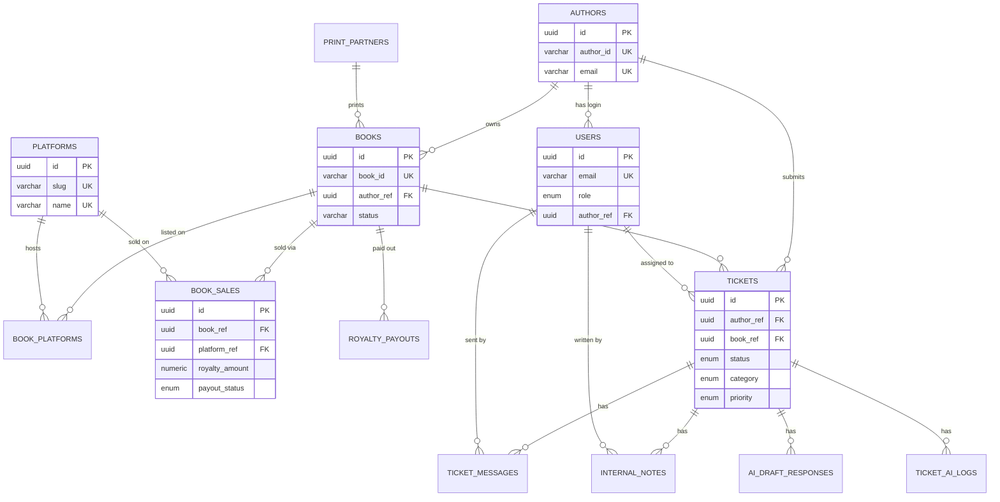

# BookLeaf Author Support Portal — Database Design & API

> **Project:** Author Support & Communication Portal  
> **Source:** [ASSIGNMENT_FINDINGS.md](./ASSIGNMENT_FINDINGS.md)  
> **Database:** PostgreSQL  
> **Status:** Refined — schemas defined

---

## Table of Contents

1. [Overview](#1-overview)
2. [Design Principles](#2-design-principles)
3. [Entity Relationship Diagram](#3-entity-relationship-diagram)
4. [Enums & Constants](#4-enums--constants)
5. [Core Tables (from sample data)](#5-core-tables-from-sample-data)
6. [Application Tables](#6-application-tables)
7. [Supporting Tables](#7-supporting-tables)
8. [Relationships Summary](#8-relationships-summary)
9. [Indexes](#9-indexes)
10. [Computed Fields & Views](#10-computed-fields--views)
11. [Seed Data Notes](#11-seed-data-notes)
12. [API Endpoints](#12-api-endpoints)

---

## 1. Overview

This document defines the database structure and REST API surface for the BookLeaf Author Support & Communication Portal.

**Two user roles:**

| Role | Scope |
|------|-------|
| `author` | Own books, own tickets, public ticket messages only |
| `admin` | All authors, all tickets, internal notes, AI tools |

**Table inventory (13 tables):**

| # | Table | Purpose |
|---|-------|---------|
| 1 | `authors` | Author profiles (seed from JSON) |
| 2 | `users` | Auth — authors + admins |
| 3 | `print_partners` | Lookup: In-House, Repro India, Epitome Books |
| 4 | `books` | Book inventory with royalty snapshot fields |
| 5 | `platforms` | Distribution channel master list |
| 6 | `book_platforms` | Book ↔ platform availability (junction) |
| 7 | `book_sales` | Per-sale line items with royalty at time of sale |
| 8 | `royalty_payouts` | Quarterly payout batches per book |
| 9 | `tickets` | Support queries with AI metadata |
| 10 | `ticket_messages` | Public conversation thread |
| 11 | `internal_notes` | Admin-only notes |
| 12 | `ai_draft_responses` | Versioned AI draft responses per ticket |
| 13 | `ticket_ai_logs` | Audit log for AI classification/priority calls |

---

## 2. Design Principles

| Principle | Detail |
|-----------|--------|
| Dual keys | UUID `id` for internal FKs; human-readable `author_id` / `book_id` from sample JSON as business keys |
| Data isolation | Author queries scoped by `author_id` from JWT |
| AI audit trail | Original AI values stored on `tickets`; full call history in `ticket_ai_logs` |
| Nullable book | `tickets.book_id` nullable for "General / Account Level" queries |
| Graceful AI failure | Tickets created with defaults when AI fails; `ai_classification_failed` flag set |
| Sales vs snapshots | `book_sales` is line-level source of truth; `books.*_total` fields are denormalized snapshots for fast author portal reads (seeded from JSON) |
| Soft delete | `deleted_at` on core entities where applicable |
| Currency | INR (₹) — `NUMERIC(12,2)` for all monetary fields |

---

## 3. Entity Relationship Diagram



---

## 4. Enums & Constants

### PostgreSQL ENUM Types

```sql
CREATE TYPE user_role AS ENUM ('author', 'admin');

CREATE TYPE ticket_status AS ENUM ('open', 'in_progress', 'resolved', 'closed');

CREATE TYPE ticket_category AS ENUM (
  'royalty_payments',
  'isbn_metadata',
  'printing_quality',
  'distribution_availability',
  'book_status_production',
  'general_inquiry'
);

CREATE TYPE ticket_priority AS ENUM ('critical', 'high', 'medium', 'low');

CREATE TYPE message_sender_type AS ENUM ('author', 'admin');

CREATE TYPE sale_payout_status AS ENUM (
  'pending',        -- royalty earned, not yet included in payout batch
  'included',       -- included in a payout batch
  'paid',           -- author has been paid
  'rolled_over'     -- below ₹1,000 threshold, rolled to next quarter
);

CREATE TYPE ai_task_type AS ENUM ('classify_prioritize', 'draft_response');

CREATE TYPE ai_log_status AS ENUM ('success', 'failed', 'fallback');
```

### Book Status (stored as VARCHAR — matches sample JSON exactly)

| Value | Notes |
|-------|-------|
| `Published & Live` | Fully published |
| `In Production - Cover Design` | BK013 |
| `In Production - Typesetting` | BK015 |
| _(extensible)_ | Other production stages as needed |

### Ticket Category Display Names

| Slug | Display Name |
|------|--------------|
| `royalty_payments` | Royalty & Payments |
| `isbn_metadata` | ISBN & Metadata Issues |
| `printing_quality` | Printing & Quality |
| `distribution_availability` | Distribution & Availability |
| `book_status_production` | Book Status & Production Updates |
| `general_inquiry` | General Inquiry |

### Seed Platform List

| Slug | Name |
|------|------|
| `amazon_india` | Amazon India |
| `flipkart` | Flipkart |
| `amazon_us` | Amazon US |
| `amazon_uk` | Amazon UK |
| `bookleaf_store` | BookLeaf Store |

### Seed Print Partners

| Slug | Name |
|------|------|
| `in_house` | In-House |
| `repro_india` | Repro India |
| `epitome_books` | Epitome Books |

---

## 5. Core Tables (from sample data)

### 5.1 `authors`

Author profile data seeded from sample JSON.

```sql
CREATE TABLE authors (
  id              UUID          PRIMARY KEY DEFAULT gen_random_uuid(),
  author_id       VARCHAR(20)   NOT NULL UNIQUE,          -- e.g. AUTH001 (business key from JSON)
  name            VARCHAR(255)  NOT NULL,
  email           VARCHAR(255)  NOT NULL UNIQUE,
  phone           VARCHAR(50),
  city            VARCHAR(100),
  joined_date     DATE          NOT NULL,
  last_login_at   TIMESTAMPTZ,
  created_at      TIMESTAMPTZ   NOT NULL DEFAULT NOW(),
  updated_at      TIMESTAMPTZ   NOT NULL DEFAULT NOW(),
  deleted_at      TIMESTAMPTZ
);
```

| Column | Type | Constraints | Notes |
|--------|------|-------------|-------|
| `id` | UUID | PK | Internal FK target |
| `author_id` | VARCHAR(20) | UNIQUE, NOT NULL | Sample key: AUTH001–AUTH010 |
| `name` | VARCHAR(255) | NOT NULL | |
| `email` | VARCHAR(255) | UNIQUE, NOT NULL | Used for login lookup via `users` |
| `phone` | VARCHAR(50) | | |
| `city` | VARCHAR(100) | | |
| `joined_date` | DATE | NOT NULL | |
| `last_login_at` | TIMESTAMPTZ | | Updated on successful author login |
| `created_at` | TIMESTAMPTZ | NOT NULL | |
| `updated_at` | TIMESTAMPTZ | NOT NULL | |
| `deleted_at` | TIMESTAMPTZ | | Soft delete |

---

### 5.2 `print_partners`

Lookup table for printing partners referenced on books.

```sql
CREATE TABLE print_partners (
  id              UUID          PRIMARY KEY DEFAULT gen_random_uuid(),
  slug            VARCHAR(50)   NOT NULL UNIQUE,          -- e.g. in_house
  name            VARCHAR(100)  NOT NULL UNIQUE,          -- e.g. In-House
  is_active       BOOLEAN       NOT NULL DEFAULT TRUE,
  created_at      TIMESTAMPTZ   NOT NULL DEFAULT NOW(),
  updated_at      TIMESTAMPTZ   NOT NULL DEFAULT NOW(),
  deleted_at      TIMESTAMPTZ
);
```

---

### 5.3 `books`

Book inventory per author. Snapshot royalty fields seeded from JSON; kept denormalized for fast author portal reads.

```sql
CREATE TABLE books (
  id                        UUID          PRIMARY KEY DEFAULT gen_random_uuid(),
  book_id                   VARCHAR(20)   NOT NULL UNIQUE,          -- e.g. BK001 (business key)
  author_ref                UUID          NOT NULL REFERENCES authors(id),
  title                     VARCHAR(500)  NOT NULL,
  isbn                      VARCHAR(20)   NOT NULL,
  genre                     VARCHAR(100),
  publication_date          DATE,                                   -- NULL for in-production
  status                    VARCHAR(100)  NOT NULL,                  -- e.g. Published & Live
  mrp                       NUMERIC(10,2),                          -- NULL for in-production
  author_royalty_per_copy   NUMERIC(10,2),                          -- NULL for in-production
  total_copies_sold         INTEGER       NOT NULL DEFAULT 0,
  total_royalty_earned      NUMERIC(12,2) NOT NULL DEFAULT 0,
  royalty_paid              NUMERIC(12,2) NOT NULL DEFAULT 0,
  royalty_pending           NUMERIC(12,2) NOT NULL DEFAULT 0,
  last_royalty_payout_date  DATE,
  print_partner_ref         UUID          REFERENCES print_partners(id),
  created_at                TIMESTAMPTZ   NOT NULL DEFAULT NOW(),
  updated_at                TIMESTAMPTZ   NOT NULL DEFAULT NOW(),
  deleted_at                TIMESTAMPTZ,

  CONSTRAINT books_isbn_unique UNIQUE (isbn)
);
```

| Column | Type | Notes |
|--------|------|-------|
| `book_id` | VARCHAR(20) | Business key from JSON (BK001–BK018) |
| `author_ref` | UUID | FK → `authors.id` |
| `publication_date` | DATE | Nullable — BK013, BK015 |
| `mrp` | NUMERIC | Nullable — in-production books |
| `author_royalty_per_copy` | NUMERIC | Nullable — in-production books |
| `total_copies_sold` | INTEGER | Denormalized snapshot; can reconcile with `book_sales` |
| `total_royalty_earned` | NUMERIC | Denormalized snapshot |
| `royalty_paid` | NUMERIC | Denormalized snapshot |
| `royalty_pending` | NUMERIC | Denormalized snapshot |
| `last_royalty_payout_date` | DATE | Nullable — never paid out on some books |
| `print_partner_ref` | UUID | Nullable — NULL for in-production books |

---

### 5.4 `platforms`

Master list of distribution platforms (`available_on` from JSON).

```sql
CREATE TABLE platforms (
  id              UUID          PRIMARY KEY DEFAULT gen_random_uuid(),
  slug            VARCHAR(50)   NOT NULL UNIQUE,          -- e.g. amazon_india
  name            VARCHAR(100)  NOT NULL UNIQUE,          -- e.g. Amazon India
  region          VARCHAR(50),                            -- e.g. IN, US, UK
  is_active       BOOLEAN       NOT NULL DEFAULT TRUE,
  created_at      TIMESTAMPTZ   NOT NULL DEFAULT NOW(),
  updated_at      TIMESTAMPTZ   NOT NULL DEFAULT NOW(),
  deleted_at      TIMESTAMPTZ
);
```

---

### 5.5 `book_platforms`

Junction table — which platforms a book is available on. Replaces `available_on[]` from JSON.

```sql
CREATE TABLE book_platforms (
  id              UUID          PRIMARY KEY DEFAULT gen_random_uuid(),
  book_ref        UUID          NOT NULL REFERENCES books(id) ON DELETE CASCADE,
  platform_ref    UUID          NOT NULL REFERENCES platforms(id),
  is_available    BOOLEAN       NOT NULL DEFAULT TRUE,
  listed_at       TIMESTAMPTZ,
  last_synced_at  TIMESTAMPTZ,                            -- for distribution sync issues
  created_at      TIMESTAMPTZ   NOT NULL DEFAULT NOW(),
  updated_at      TIMESTAMPTZ   NOT NULL DEFAULT NOW(),
  deleted_at      TIMESTAMPTZ,

  CONSTRAINT book_platforms_unique UNIQUE (book_ref, platform_ref)
);
```

---

## 6. Application Tables

### 6.1 `users`

Authentication and role management. One user row per author login + admin account(s).

```sql
CREATE TABLE users (
  id              UUID          PRIMARY KEY DEFAULT gen_random_uuid(),
  email           VARCHAR(255)  NOT NULL UNIQUE,
  password_hash   VARCHAR(255)  NOT NULL,
  role            user_role     NOT NULL,
  author_ref      UUID          REFERENCES authors(id),   -- NULL for admins
  name            VARCHAR(255)  NOT NULL,
  is_active       BOOLEAN       NOT NULL DEFAULT TRUE,
  last_login_at   TIMESTAMPTZ,
  created_at      TIMESTAMPTZ   NOT NULL DEFAULT NOW(),
  updated_at      TIMESTAMPTZ   NOT NULL DEFAULT NOW(),
  deleted_at      TIMESTAMPTZ,

  CONSTRAINT users_author_role_check
    CHECK (
      (role = 'author' AND author_ref IS NOT NULL) OR
      (role = 'admin'  AND author_ref IS NULL)
    )
);
```

| Column | Notes |
|--------|-------|
| `author_ref` | Required when `role = author`; links to `authors.id` |
| `password_hash` | bcrypt/argon2 — not in sample JSON; seed with uniform test password |
| Admin seed | At least one row with `role = admin`, `author_ref = NULL` |

---

### 6.2 `tickets`

Support queries submitted by authors.

```sql
CREATE TABLE tickets (
  id                        UUID              PRIMARY KEY DEFAULT gen_random_uuid(),
  ticket_number             VARCHAR(20)       NOT NULL UNIQUE,      -- e.g. TKT-2025-00001
  author_ref                UUID              NOT NULL REFERENCES authors(id),
  book_ref                  UUID              REFERENCES books(id),  -- NULL = General / Account Level
  subject                   VARCHAR(500)      NOT NULL,
  description               TEXT              NOT NULL,
  status                    ticket_status     NOT NULL DEFAULT 'open',
  category                  ticket_category,                        -- NULL until AI/manual set
  priority                  ticket_priority,                        -- NULL until AI/manual set
  ai_category               ticket_category,                        -- original AI output
  ai_priority               ticket_priority,                        -- original AI output
  category_overridden       BOOLEAN           NOT NULL DEFAULT FALSE,
  priority_overridden       BOOLEAN           NOT NULL DEFAULT FALSE,
  assigned_admin_ref        UUID              REFERENCES users(id),
  ai_classification_failed  BOOLEAN           NOT NULL DEFAULT FALSE,
  ai_classified_at          TIMESTAMPTZ,
  created_at                TIMESTAMPTZ       NOT NULL DEFAULT NOW(),
  updated_at                TIMESTAMPTZ       NOT NULL DEFAULT NOW(),
  deleted_at                TIMESTAMPTZ
);
```

**Design decisions:**

| Decision | Choice |
|----------|--------|
| Description storage | Lives on `tickets.description`; initial author message also created in `ticket_messages` on submit |
| AI failure defaults | `category = general_inquiry`, `priority = medium`, `ai_classification_failed = TRUE` |
| `ticket_number` | Human-readable ID for admin queue display |

---

### 6.3 `ticket_messages`

Public conversation thread — visible to author. Author is read-only after initial submit (v1).

```sql
CREATE TABLE ticket_messages (
  id              UUID                  PRIMARY KEY DEFAULT gen_random_uuid(),
  ticket_ref      UUID                  NOT NULL REFERENCES tickets(id) ON DELETE CASCADE,
  sender_type     message_sender_type   NOT NULL,
  sender_ref      UUID                  NOT NULL REFERENCES users(id),
  content         TEXT                  NOT NULL,
  is_initial      BOOLEAN               NOT NULL DEFAULT FALSE,   -- TRUE for author's opening message
  created_at      TIMESTAMPTZ           NOT NULL DEFAULT NOW(),
  updated_at      TIMESTAMPTZ           NOT NULL DEFAULT NOW(),
  deleted_at      TIMESTAMPTZ
);
```

---

### 6.4 `internal_notes`

Admin-only notes — **never returned on author-facing endpoints**.

```sql
CREATE TABLE internal_notes (
  id              UUID          PRIMARY KEY DEFAULT gen_random_uuid(),
  ticket_ref      UUID          NOT NULL REFERENCES tickets(id) ON DELETE CASCADE,
  admin_ref       UUID          NOT NULL REFERENCES users(id),
  content         TEXT          NOT NULL,
  created_at      TIMESTAMPTZ   NOT NULL DEFAULT NOW(),
  updated_at      TIMESTAMPTZ   NOT NULL DEFAULT NOW(),
  deleted_at      TIMESTAMPTZ
);
```

---

### 6.5 `ai_draft_responses`

Versioned AI draft responses. Latest non-superseded draft shown when admin opens ticket.

```sql
CREATE TABLE ai_draft_responses (
  id              UUID          PRIMARY KEY DEFAULT gen_random_uuid(),
  ticket_ref      UUID          NOT NULL REFERENCES tickets(id) ON DELETE CASCADE,
  content         TEXT          NOT NULL,
  model           VARCHAR(100),                           -- e.g. gpt-4o-mini
  prompt_tokens   INTEGER,
  completion_tokens INTEGER,
  is_current      BOOLEAN       NOT NULL DEFAULT TRUE,    -- latest draft for this ticket
  generated_by    UUID          REFERENCES users(id),     -- admin who triggered regen (NULL = auto)
  created_at      TIMESTAMPTZ   NOT NULL DEFAULT NOW()
);
```

**Behavior:**
- On admin opens ticket → generate draft if none exists; set `is_current = TRUE`
- On regenerate → set previous drafts `is_current = FALSE`; insert new row
- Avoids overwriting drafts; supports audit and cost tracking

---

## 7. Supporting Tables

### 7.1 `book_sales`

Per-sale line items. Stores royalty **at time of sale** (not a global rate table). Source of truth for sales detail; `books` totals are denormalized snapshots.

```sql
CREATE TABLE book_sales (
  id                UUID                PRIMARY KEY DEFAULT gen_random_uuid(),
  book_ref          UUID                NOT NULL REFERENCES books(id),
  platform_ref      UUID                REFERENCES platforms(id),
  sale_date         DATE                NOT NULL,
  quantity          INTEGER             NOT NULL DEFAULT 1,
  unit_mrp          NUMERIC(10,2),                          -- MRP at time of sale
  royalty_per_copy  NUMERIC(10,2)       NOT NULL,            -- author share at time of sale
  royalty_amount    NUMERIC(12,2)       NOT NULL,            -- quantity × royalty_per_copy
  payout_status     sale_payout_status  NOT NULL DEFAULT 'pending',
  payout_ref        UUID,                                     -- FK → royalty_payouts (when paid)
  order_reference   VARCHAR(100),                             -- external platform order ID
  created_at        TIMESTAMPTZ         NOT NULL DEFAULT NOW(),
  updated_at        TIMESTAMPTZ         NOT NULL DEFAULT NOW()
);
```

| Column | Purpose |
|--------|---------|
| `royalty_per_copy` | Locked at sale time — handles MRP/rate changes over book lifetime |
| `royalty_amount` | Total author royalty for this sale line |
| `payout_status` | `pending` → `included` → `paid` or `rolled_over` (below ₹1,000 threshold) |
| `order_reference` | Traceability to platform order |

**Seed note:** Sample JSON only has aggregates. Seed `books` snapshot fields directly; `book_sales` can be populated later or with synthetic line items for demo royalty breakdown.

---

### 7.2 `royalty_payouts`

Quarterly payout batches — supports AI responses with specific payout dates and amounts.

```sql
CREATE TABLE royalty_payouts (
  id                UUID          PRIMARY KEY DEFAULT gen_random_uuid(),
  book_ref          UUID          NOT NULL REFERENCES books(id),
  author_ref        UUID          NOT NULL REFERENCES authors(id),
  quarter_label     VARCHAR(10)   NOT NULL,                 -- e.g. Q3-2025
  period_start      DATE          NOT NULL,
  period_end        DATE          NOT NULL,
  gross_amount      NUMERIC(12,2) NOT NULL,
  net_amount        NUMERIC(12,2) NOT NULL,                 -- after BookLeaf 20% share
  payout_date       DATE,
  status            VARCHAR(20)   NOT NULL DEFAULT 'pending', -- pending | processed | failed
  bank_reference    VARCHAR(100),
  created_at        TIMESTAMPTZ   NOT NULL DEFAULT NOW(),
  updated_at        TIMESTAMPTZ   NOT NULL DEFAULT NOW()
);
```

**Use case:** When author asks "when will I get paid?", AI draft pulls from `royalty_payouts` + `books.royalty_pending` + policy (45 days after quarter end, ₹1,000 minimum).

---

### 7.3 `ticket_ai_logs`

Audit trail for all AI calls — supports evaluation criteria (cost awareness, graceful degradation).

```sql
CREATE TABLE ticket_ai_logs (
  id                UUID            PRIMARY KEY DEFAULT gen_random_uuid(),
  ticket_ref        UUID            NOT NULL REFERENCES tickets(id) ON DELETE CASCADE,
  task_type         ai_task_type    NOT NULL,
  status            ai_log_status   NOT NULL,
  model             VARCHAR(100),
  input_tokens      INTEGER,
  output_tokens     INTEGER,
  latency_ms        INTEGER,
  request_payload   JSONB,                                  -- sanitized prompt metadata
  response_payload  JSONB,                                  -- structured AI output
  error_message     TEXT,
  created_at        TIMESTAMPTZ     NOT NULL DEFAULT NOW()
);
```

---

## 8. Relationships Summary

| From | To | Cardinality | FK Column | On Delete |
|------|----|-------------|-----------|-----------|
| `users` | `authors` | N → 0..1 | `users.author_ref` | SET NULL |
| `books` | `authors` | N → 1 | `books.author_ref` | RESTRICT |
| `books` | `print_partners` | N → 0..1 | `books.print_partner_ref` | SET NULL |
| `book_platforms` | `books` | N → 1 | `book_platforms.book_ref` | CASCADE |
| `book_platforms` | `platforms` | N → 1 | `book_platforms.platform_ref` | RESTRICT |
| `book_sales` | `books` | N → 1 | `book_sales.book_ref` | RESTRICT |
| `book_sales` | `platforms` | N → 0..1 | `book_sales.platform_ref` | SET NULL |
| `book_sales` | `royalty_payouts` | N → 0..1 | `book_sales.payout_ref` | SET NULL |
| `royalty_payouts` | `books` | N → 1 | `royalty_payouts.book_ref` | RESTRICT |
| `royalty_payouts` | `authors` | N → 1 | `royalty_payouts.author_ref` | RESTRICT |
| `tickets` | `authors` | N → 1 | `tickets.author_ref` | RESTRICT |
| `tickets` | `books` | N → 0..1 | `tickets.book_ref` | SET NULL |
| `tickets` | `users` | N → 0..1 | `tickets.assigned_admin_ref` | SET NULL |
| `ticket_messages` | `tickets` | N → 1 | `ticket_messages.ticket_ref` | CASCADE |
| `ticket_messages` | `users` | N → 1 | `ticket_messages.sender_ref` | RESTRICT |
| `internal_notes` | `tickets` | N → 1 | `internal_notes.ticket_ref` | CASCADE |
| `internal_notes` | `users` | N → 1 | `internal_notes.admin_ref` | RESTRICT |
| `ai_draft_responses` | `tickets` | N → 1 | `ai_draft_responses.ticket_ref` | CASCADE |
| `ticket_ai_logs` | `tickets` | N → 1 | `ticket_ai_logs.ticket_ref` | CASCADE |

---

## 9. Indexes

| Table | Index | Type | Purpose |
|-------|-------|------|---------|
| `authors` | `author_id` | UNIQUE | Business key lookup |
| `authors` | `email` | UNIQUE | Login resolution |
| `authors` | `deleted_at` | BTREE | Soft-delete filter |
| `users` | `email` | UNIQUE | Login |
| `users` | `author_ref` | BTREE | Author user lookup |
| `users` | `role` | BTREE | Admin queries |
| `books` | `book_id` | UNIQUE | Business key lookup |
| `books` | `author_ref` | BTREE | Author books list |
| `books` | `isbn` | UNIQUE | ISBN lookup (ticket context) |
| `books` | `status` | BTREE | Production status filter |
| `platforms` | `slug` | UNIQUE | Seed/migration lookup |
| `book_platforms` | `(book_ref, platform_ref)` | UNIQUE | Prevent duplicates |
| `book_platforms` | `platform_ref` | BTREE | Platform-wide queries |
| `book_sales` | `book_ref, sale_date` | BTREE | Sales history per book |
| `book_sales` | `payout_status` | BTREE | Pending royalty queries |
| `book_sales` | `payout_ref` | BTREE | Payout batch reconciliation |
| `royalty_payouts` | `book_ref, quarter_label` | UNIQUE | One payout per book per quarter |
| `royalty_payouts` | `author_ref` | BTREE | Author payout history |
| `tickets` | `ticket_number` | UNIQUE | Human-readable lookup |
| `tickets` | `author_ref` | BTREE | Author ticket list |
| `tickets` | `(status, priority, created_at DESC)` | BTREE | Admin queue default sort |
| `tickets` | `category` | BTREE | Category filter |
| `tickets` | `assigned_admin_ref` | BTREE | My tickets filter |
| `tickets` | `created_at` | BTREE | Date range filter |
| `ticket_messages` | `(ticket_ref, created_at)` | BTREE | Thread ordering |
| `internal_notes` | `ticket_ref` | BTREE | Notes by ticket |
| `ai_draft_responses` | `(ticket_ref, is_current)` | BTREE | Latest draft lookup |
| `ticket_ai_logs` | `ticket_ref` | BTREE | AI audit per ticket |

---

## 10. Computed Fields & Views

### `author_books_view`

Convenience view for author portal — joins books with platforms and print partner.

```sql
CREATE VIEW author_books_view AS
SELECT
  b.id,
  b.book_id,
  b.author_ref,
  a.author_id,
  b.title,
  b.isbn,
  b.genre,
  b.publication_date,
  b.status,
  b.mrp,
  b.total_copies_sold,
  b.total_royalty_earned,
  b.royalty_paid,
  b.royalty_pending,
  b.last_royalty_payout_date,
  pp.name AS print_partner,
  COALESCE(
    ARRAY_AGG(p.name ORDER BY p.name) FILTER (WHERE p.name IS NOT NULL AND bp.is_available),
    ARRAY[]::VARCHAR[]
  ) AS available_on
FROM books b
JOIN authors a ON a.id = b.author_ref
LEFT JOIN print_partners pp ON pp.id = b.print_partner_ref
LEFT JOIN book_platforms bp ON bp.book_ref = b.id AND bp.deleted_at IS NULL
LEFT JOIN platforms p ON p.id = bp.platform_ref AND p.deleted_at IS NULL
WHERE b.deleted_at IS NULL
GROUP BY b.id, a.author_id, pp.name;
```

### Reconciliation note

When `book_sales` is populated, periodically reconcile:

```sql
-- Example: update book snapshot from sales
UPDATE books b SET
  total_copies_sold    = s.total_qty,
  total_royalty_earned = s.total_royalty,
  royalty_pending      = s.pending_royalty
FROM (
  SELECT book_ref,
         SUM(quantity) AS total_qty,
         SUM(royalty_amount) AS total_royalty,
         SUM(royalty_amount) FILTER (WHERE payout_status IN ('pending','rolled_over')) AS pending_royalty
  FROM book_sales GROUP BY book_ref
) s
WHERE b.id = s.book_ref;
```

For assignment seed: load JSON aggregates directly into `books`; reconciliation is optional.

---

## 11. Seed Data Notes

| Item | Detail |
|------|--------|
| Source file | `bookleaf_sample_data (full stack) (1) (1).json` |
| Authors | 10 (AUTH001–AUTH010) |
| Books | 18 (BK001–BK018) |
| Platforms | 5 from seed list |
| Print partners | 3 from seed list |
| Author passwords | Not in JSON — uniform test password (e.g. `Password123!`), document in README |
| Admin user | 1+ admin: `admin@bookleaf.com` / same test password |
| `book_platforms` | Seed from each book's `available_on[]` |
| `book_sales` | Optional — JSON has aggregates only; seed `books` totals directly |
| `royalty_payouts` | Optional — derive from `last_royalty_payout_date` + `royalty_paid` where present |

### Edge cases to preserve in seed

| Case | Books |
|------|-------|
| In production (null MRP/date) | BK013, BK015 |
| Zero royalty paid, pending exists | BK005, BK010, BK016, BK018 |
| Fully paid out (pending = 0) | BK002, BK007, BK008, BK014 |
| Below ₹1,000 threshold | BK016 (₹850), BK018 (₹1,575) |
| High volume | BK004 (1,203), BK011 (1,567) |
| No platforms listed | BK013, BK015 |

### Seed order (respects FK dependencies)

```
1. print_partners
2. platforms
3. authors
4. users (authors + admin)
5. books
6. book_platforms
7. book_sales (optional)
8. royalty_payouts (optional)
9. tickets / messages / notes (demo tickets, optional)
```

---

## 12. API Endpoints

All routes require authentication unless noted.  
Base path: `/api`

**Auth:** JWT in `Authorization: Bearer <token>` header.

**RBAC:**
- `author` → `/api/author/*` only, scoped to own `author_id`
- `admin` → `/api/admin/*` only
- Cross-role or cross-author access → `403 Forbidden`

---

### 12.1 Authentication

| Method | Endpoint | Role | Description |
|--------|----------|------|-------------|
| `POST` | `/api/auth/login` | Public | Login; returns JWT + user profile |
| `POST` | `/api/auth/logout` | Auth | Invalidate token (if using blocklist) |
| `GET` | `/api/auth/me` | Auth | Current user profile |

**Login request:**

```json
{ "email": "string", "password": "string" }
```

**Login response:**

```json
{
  "token": "string",
  "user": {
    "id": "uuid",
    "email": "string",
    "role": "author | admin",
    "author_id": "AUTH001 | null",
    "name": "string"
  }
}
```

---

### 12.2 Author — Books

| Method | Endpoint | Role | Description |
|--------|----------|------|-------------|
| `GET` | `/api/author/books` | Author | List own books (from `author_books_view`) |
| `GET` | `/api/author/books/:book_id` | Author | Single book detail + platforms |

**List response fields:**

| Field | Source |
|-------|--------|
| `book_id` | `books.book_id` |
| `title`, `isbn`, `genre`, `status` | `books` |
| `publication_date`, `mrp` | `books` (nullable) |
| `total_copies_sold` | `books` |
| `total_royalty_earned`, `royalty_paid`, `royalty_pending` | `books` |
| `available_on` | aggregated from `book_platforms` → `platforms` |
| `print_partner` | `print_partners.name` |

---

### 12.3 Author — Tickets

| Method | Endpoint | Role | Description |
|--------|----------|------|-------------|
| `GET` | `/api/author/tickets` | Author | List own tickets |
| `POST` | `/api/author/tickets` | Author | Create ticket → triggers AI classify + prioritize |
| `GET` | `/api/author/tickets/:id` | Author | Detail + public messages only |
| `GET` | `/api/author/tickets/stream` | Author | SSE for real-time updates |

**Create ticket:**

```json
{
  "book_id": "BK001 | null",
  "subject": "string",
  "description": "string"
}
```

**On create (server-side):**
1. Insert `tickets` (status: `open`)
2. Insert `ticket_messages` (author initial message, `is_initial: true`)
3. Async: AI classify + prioritize → update `tickets`, log to `ticket_ai_logs`
4. On AI failure: set defaults, `ai_classification_failed = true`

**Excluded from author responses:** `internal_notes`, `ai_draft_responses`, `ticket_ai_logs`, AI override flags

---

### 12.4 Admin — Tickets

| Method | Endpoint | Role | Description |
|--------|----------|------|-------------|
| `GET` | `/api/admin/tickets` | Admin | All tickets with filters + sort |
| `GET` | `/api/admin/tickets/:id` | Admin | Full detail: messages, notes, AI draft, AI metadata |
| `PATCH` | `/api/admin/tickets/:id` | Admin | Update status, category, priority, assignee |
| `POST` | `/api/admin/tickets/:id/responses` | Admin | Send public response → push real-time to author |
| `POST` | `/api/admin/tickets/:id/notes` | Admin | Add internal note |
| `POST` | `/api/admin/tickets/:id/ai-draft` | Admin | Regenerate AI draft → new `ai_draft_responses` row |

**List query params:**

```
?status=open
&category=royalty_payments
&priority=high
&from=2025-01-01
&to=2025-12-31
&assigned_to=me | {user_uuid}
&author_id=AUTH001
&sort=priority,created_at
&order=desc
```

**Default sort:** Critical/High first, then oldest Open.

**PATCH body (partial):**

```json
{
  "status": "open | in_progress | resolved | closed",
  "category": "royalty_payments | ...",
  "priority": "critical | high | medium | low",
  "assigned_admin_id": "uuid | null"
}
```

Setting `category` or `priority` manually sets `category_overridden` / `priority_overridden` to `true`.

---

### 12.5 Admin — Authors & Books _(read-only helpers)_

| Method | Endpoint | Role | Description |
|--------|----------|------|-------------|
| `GET` | `/api/admin/authors` | Admin | List all authors (for queue context) |
| `GET` | `/api/admin/authors/:author_id/books` | Admin | Author's books (for ticket context / AI draft) |

---

### 12.6 Real-Time Updates

| Method | Endpoint | Role | Description |
|--------|----------|------|-------------|
| `GET` | `/api/author/tickets/stream` | Author | SSE — new response, status change |
| `GET` | `/api/admin/tickets/stream` | Admin | SSE — new ticket, ticket update |
| `GET` | `/api/author/tickets?since={iso_timestamp}` | Author | Polling fallback |

**SSE event types:**

| Event | Payload |
|-------|---------|
| `ticket.updated` | `{ ticket_id, status, updated_at }` |
| `ticket.message.created` | `{ ticket_id, message }` |
| `ticket.created` | `{ ticket }` _(admin stream only)_ |

---

### 12.7 Health & Docs

| Method | Endpoint | Role | Description |
|--------|----------|------|-------------|
| `GET` | `/api/health` | Public | Health check |
| `GET` | `/api/docs` | Public | Swagger / OpenAPI UI |

---

### 12.8 Endpoint Summary Matrix

| # | Method | Endpoint | Auth | Priority |
|---|--------|----------|------|----------|
| 1 | POST | `/api/auth/login` | Public | Must have |
| 2 | POST | `/api/auth/logout` | Auth | Must have |
| 3 | GET | `/api/auth/me` | Auth | Must have |
| 4 | GET | `/api/author/books` | Author | Must have |
| 5 | GET | `/api/author/books/:book_id` | Author | Should have |
| 6 | GET | `/api/author/tickets` | Author | Must have |
| 7 | POST | `/api/author/tickets` | Author | Must have |
| 8 | GET | `/api/author/tickets/:id` | Author | Must have |
| 9 | GET | `/api/author/tickets/stream` | Author | Should have |
| 10 | GET | `/api/admin/tickets` | Admin | Must have |
| 11 | GET | `/api/admin/tickets/:id` | Admin | Must have |
| 12 | PATCH | `/api/admin/tickets/:id` | Admin | Must have |
| 13 | POST | `/api/admin/tickets/:id/responses` | Admin | Must have |
| 14 | POST | `/api/admin/tickets/:id/notes` | Admin | Should have |
| 15 | POST | `/api/admin/tickets/:id/ai-draft` | Admin | Nice to have |
| 16 | GET | `/api/admin/authors` | Admin | Should have |
| 17 | GET | `/api/admin/authors/:author_id/books` | Admin | Should have |
| 18 | GET | `/api/admin/tickets/stream` | Admin | Nice to have |
| 19 | GET | `/api/health` | Public | Nice to have |

---

### 12.9 Standard Error Response

```json
{
  "error": {
    "code": "VALIDATION_ERROR | UNAUTHORIZED | FORBIDDEN | NOT_FOUND | AI_SERVICE_UNAVAILABLE | INTERNAL_ERROR",
    "message": "Human-readable message",
    "details": []
  }
}
```

| HTTP | When |
|------|------|
| `400` | Validation failure |
| `401` | Missing / invalid token |
| `403` | Wrong role or accessing another author's data |
| `404` | Resource not found |
| `503` | AI service down (ticket still created; draft endpoint only) |
| `500` | Unexpected server error |

---

## Changelog

| Date | Change |
|------|--------|
| 2025-06-19 | Initial draft — schema placeholders, endpoints defined |
| 2025-06-19 | Refined — full PostgreSQL schemas, platforms/sales/payouts/AI audit tables, updated ER diagram & endpoints |
